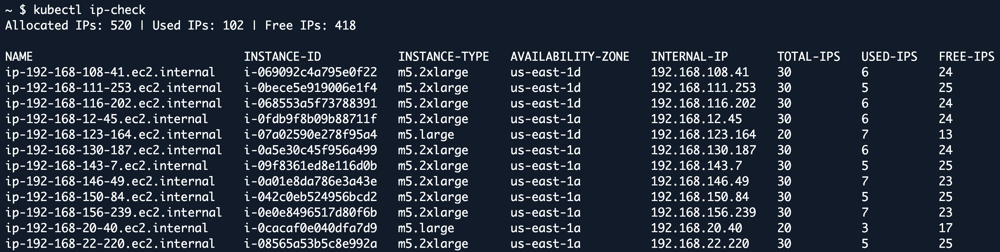

# kubectl ip-check

A kubectl plugin to improve visibility on IP address utilization in EKS clusters with VPC CNI.



## Overview

`ip-check` plugin is designed to check the status of IP addresses in your Kubernetes cluster. It provides visibility into total allocated IPs, used IPs, and free IPs throughout the cluster by fetching details from EC2 instances and analyzing pod IPs on each node.

For each node, the plugin:
- Retrieves total IP addresses from network interfaces attached to EC2 instances
- Counts used IPs from pods that are not using host networking
- Calculates free/unused IP addresses allocated to nodes

**Currently supports:** AWS EKS clusters with VPC CNI

## Installation

### Via Krew (plugin manager)

```bash
kubectl krew install ip-check
```

### Manual Installation

1. Download the latest tar zip from the [releases page](https://github.com/4rivappa/kubectl-ip-check/releases)
2. Extract executable and place it in your PATH:

```bash
# Extract executable and move it to your PATH
sudo mv kubectl-ip_check /usr/local/bin/kubectl-ip_check
```

## Motivation

With smaller CIDR ranges in VPC subnets, using default configurations of VPC CNI can quickly exhaust available IP addresses in the network. As shown in the example above, nearly 75-80% of IPs are unused but allocated to nodes in the cluster due to default configuration settings (`WARM_ENI_TARGET`, `WARM_IP_TARGET`).

This plugin helps users:
- **Gain visibility** into IP address usage across the cluster
- **Detect overallocation** in IP allocation
- **Optimize VPC CNI configuration** to mitigate IP exhaustion
- **Plan capacity** for cluster scaling
- **Troubleshoot** IP-related issues

## How It Works

The plugin operates by:

1. **Discovering Nodes**: Uses the Kubernetes API to list all nodes in the cluster
2. **Analyzing ENIs**: Calls AWS EC2 `DescribeNetworkInterfaces` API for each node instance to get total allocated IP addresses
3. **Counting Pod IPs**: Queries Kubernetes API to count pod IPs on each node (excluding host-networked pods)
4. **Calculating Usage**: Computes used vs. free IP addresses per node and aggregates cluster-wide statistics

## Required Permissions

The plugin requires the following permissions to function:

**AWS:**
- `ec2:DescribeNetworkInterfaces` permission for the instances in your cluster

**Kubernetes:**
- Read access to `nodes` and `pods` resources in the cluster

## Configuration

The plugin automatically detects your Kubernetes configuration from:
1. In-cluster service account (when running inside a pod)
2. `~/.kube/config` file
3. `KUBECONFIG` environment variable

AWS credentials are resolved using the standard AWS credential chain:
1. Environment variables (`AWS_ACCESS_KEY_ID`, `AWS_SECRET_ACCESS_KEY`)
2. AWS credentials file (`~/.aws/credentials`)

## License

This project is licensed under the MIT License - see the [LICENSE](LICENSE) file for details.